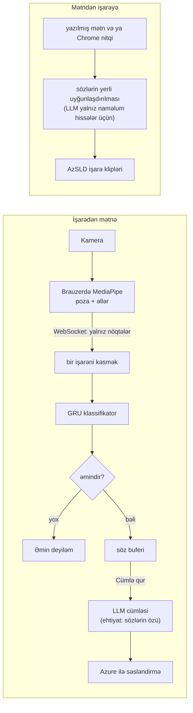

# Aven — A way to understand

[English](README.md) · **Azərbaycanca**

Aven **Azərbaycan işarə dili (AzSL)** üçün köməkçi veb tətbiqdir. Kameradan işarələri oxuyub Azərbaycan dilində
mətnə və səsə çevirir, yazılan və ya deyilən mətn üçün isə işarə videolarını göstərir. Tətbiq tərcüməçi olmadan
xidmət masasında, ofisdə və ya telefonda üz-üzə gələn kar işarəçi ilə eşidən insan üçün nəzərdə tutulub.

**Canlı demo:** https://azsl-assistant-production.up.railway.app (Chrome; kameraya icazə verin) ·
**Texniki təlimat (ingiliscə):** [sign-assistant/README.md](sign-assistant/README.md)

> **Təhlükəsizlik.** Aven köməkçi prototipdir, təsdiqlənmiş tərcümə deyil. Əmin olmayanda
> "Əmin deyiləm, zəhmət olmasa təkrar edin." deyir və heç bir söz əlavə etmir. Tibbi və hüquqi qərarlar üçün
> istifadə etməyin, surdotərcüməçiyə müraciət edin.

## Nə edir

| | İşarədən mətnə (İstiqamət A) | Mətndən işarəyə (İstiqamət B) |
|---|---|---|
| Kim istifadə edir | işarə dilində danışan kar insan | yazan və ya danışan eşidən insan |
| Giriş | kamera, hər dəfə bir işarə | yazılmış mətn və ya Chrome-da nitq |
| Çıxış | tanınan hər söz, sonra Azərbaycan dilində cümlə («Cümlə qur») və onun səsləndirilməsi («Səsləndir») | işarələr dataset videoları kimi ardıcıl, söz altyazı ilə |
| Lüğət | 60 işarə | 100 söz; işarəsi olmayan söz qırmızı göstərilir |
| Səhifə | `/` | `/signs.html` |

Kamera görüntüsü brauzerdən çıxmır: bədən və əl nöqtələrini MediaPipe brauzerin özündə tapır, serverə yalnız bu
koordinatlar gedir.

## Necə işləyir



Serverdə Python 3.11 və FastAPI, klassifikator üçün PyTorch, brauzerdə MediaPipe Tasks, səhifələr üçün sadə HTML,
CSS və JavaScript işlədilir. İnterfeys yormamaq üçün qurulub: iri yazı, vəziyyət eyni anda ikon, mətn və rənglə
göstərilir, açıq və tünd tema var, telefon, planşet, noutbuk və proyektor üçün ayrıca düzülüş var.

## Feasibility (reallaşdırıla bilənlik)

Aşağıdakı hər rəqəm bu layihədə 9 oktyabr 2026-da ölçülüb.

| Sahə | Vəziyyət | Ölçülmüş sübut |
|---|---|---|
| Texniki | Hazır | Başdan sona işləyir: brauzerdə MediaPipe 27 ms/kadr (noutbuk GPU-sunda ~37 fps), serverdə tanıma bir işarə üçün 5–13 ms; 245 avtomatik test keçir. |
| Data | Hazır | AzSLD açıq dataseti: 100 söz, 7 248 video. 60 işarə tanınır, 100 söz video kliplə göstərilir. |
| Model | Qismən | Val: top-1 69.5%, makro 81.5%. Cavab verdiyi halların 95.9%-i düzgündür; kliplərin 40%-nə cavab verir, qalanında «Əmin deyiləm» deyir. |
| Xərc | Aşağı | Təlim adi noutbukda CPU ilə bir neçə dəqiqə çəkir (ilk 40 sinifli model: 5 dəq 44 san). Tanıma istifadəçinin brauzerində işləyir; LLM və nitq pulsuz planlarda. |
| Hüquq, məxfilik | Demo üçün hazır | Data CC BY 4.0, işarəçilər razılıq verib. Serverə yalnız nöqtə koordinatları gedir. |
| İstifadə | Sınaq lazım | Quraşdırma yoxdur: telefon, planşet, noutbuk, proyektor. Canlı demo internetdədir; növbəti addım kar istifadəçilərlə sınaqdır. |

Risklər və onlarla nə edirik:

- **Yeni işarəçi:** modelin heç görmədiyi işarəçidə dəqiqlik hələ ölçülməyib, çünki val dəstində təlimdəki
  işarəçilər var. Növbəti addım: komanda yazıları ilə ayrıca test (protokol:
  [data/team_recordings/README.md](sign-assistant/data/team_recordings/README.md)), sonra kar istifadəçilərlə sınaq.
- **Oxşar işarələr:** MƏN / MƏNİM / MƏNƏ və O / ONUN / ORDA qarışır. «Əmin deyiləm» qaydası səhv sözü cümləyə
  salmır; bu sinifləri birləşdirmək planlaşdırılır.
- **Kiçik lüğət:** 60 tanınan işarə (9 oktyabr 2026-da 40-dan genişləndirilib) və 100 göstərilən söz. Növbəti addım:
  daha çox söz və daha çox işarəçi.
- **Əhatə:** yalnız ayrı-ayrı işarələr, üz ifadələri hələ yoxdur. Növbəti mərhələ: davamlı işarə dili, üz və ağız
  hərəkətləri.

## Nəticələr

9 qeyd tarixindən 1 280 klip üzərində val, GRU modeli, 60 sinif ([sign-assistant/eval/REPORT.md](sign-assistant/eval/REPORT.md);
ilk 40 sinifli model: [sign-assistant/eval/REPORT_40_CLASSES.md](sign-assistant/eval/REPORT_40_CLASSES.md)):

| göstərici | dəyər |
|---|---|
| top-1 dəqiqlik, imtinasız | 69.5% |
| makro dəqiqlik (siniflər balanssızdır) | 81.5% |
| cavab verilən kliplər (tau 0.9, margin 0.2) | 40.0% (1 280-dən 512) |
| cavabların dəqiqliyi | 95.9% (512-dən 491) |

Bu rəqəmlər yeni işarəçi üçün nikbindir: AzSLD-də işarəçi ID-si yoxdur, ona görə val qeyd tarixinə görə ayrılıb və
eyni işarəçilər təlimdə də var.

## Lokal işə salmaq

```bash
cd sign-assistant
python3.11 -m venv .venv && source .venv/bin/activate   # Windows: py -3.11 -m venv .venv; .venv\Scripts\activate
pip install -r requirements.txt
bash scripts/get_models.sh        # MediaPipe modelləri -> web/models/
pytest -q
uvicorn api.main:app              # http://localhost:8000 və http://localhost:8000/signs.html
```

Model çəkiləri (`model/artifacts/model.pt`) və işarə klipləri (`data/clips/`) git-də yoxdur: onları data
pipeline ilə qurun və ya komanda yoldaşından köçürün. Onlarsız hər işarəyə «Əmin deyiləm» cavabı gəlir
(`model_not_loaded`). `sign-assistant/.env`-dəki açarlar məcburi deyil (cümlə üçün `GROQ_API_KEY` və ya
`ANTHROPIC_API_KEY`, səs üçün `AZURE_SPEECH_KEY`); açar olmayanda tətbiq ehtiyat yollarından istifadə edir. Tam
quraşdırma, data pipeline, təlim və deploy: [sign-assistant/README.md](sign-assistant/README.md).

## Repozitoriya

| qovluq | içində nə var |
|---|---|
| `sign-assistant/web/` | iki səhifə (`index.html`, `signs.html`), onların skriptləri, dizayn sistemi (`style.css`, `ui.js`) və şriftlər |
| `sign-assistant/api/` | FastAPI tətbiqi: WebSocket və POST ilə tanıma, cümlə qurmaq, mətndən işarəyə, səsləndirmə |
| `sign-assistant/pose/` | nöqtələrin normallaşdırılması, xüsusiyyətlər, işarənin kəsilməsi, datasetdən nöqtə çıxarışı |
| `sign-assistant/model/` | dataset, GRU və transformer şəbəkələri, təlim, kalibrləmə, imtina qaydası, proqnozlaşdırıcı |
| `sign-assistant/data/` | lüğətlər, bölgülər, kliplərin qurulması və data hesabatları (xam videolar, nöqtələr və kliplər git-dən kənarda qalır) |
| `sign-assistant/eval/` | qiymətləndirmə skripti və hesabatı |
| `sign-assistant/tests/` | avtomatik testlər |
| `sign-assistant/docs/` | nitq və LLM yoxlamaları |

Dörd nəfərlik komanda işi rollara bölür (data və model, frontend, backend və LLM, nitq və qiymətləndirmə); fayl
sahibliyi və data formatları [sign-assistant/CONTRACT.md](sign-assistant/CONTRACT.md)-də sabitlənib.

## Məxfilik

- Kamera görüntüsü brauzerdə qalır; serverə yalnız bədən və əl koordinatları göndərilir.
- «Səsləndir» istifadə olunanda cümlənin mətni səsləndirmə üçün Microsoft Azure-a gedir.
- Mətn səhifəsində mikrofon istifadə olunanda Chrome səsi tanımaq üçün Google-a göndərir.
- LLM açarı varsa, tanınan işarələr və yazılan mətn həmin LLM xidmətinə (Groq və ya Anthropic) gedir.

## Mənbələr və lisenziyalar

- **İşarə videoları və təlim datası:** AzSLD – Azerbaijani Sign Language Dataset, N. Alishzade və J. Hasanov,
  CC BY 4.0, DOI [10.5281/zenodo.14222948](https://doi.org/10.5281/zenodo.14222948). Kliplər komanda tərəfindən
  kəsilib və yenidən kodlanıb. Məqalə: Alishzade, N., Hasanov, J. (2025). AzSLD: Azerbaijani sign language dataset
  for fingerspelling, word, and sentence translation with baseline software. Data in Brief 58, 111230.
  https://doi.org/10.1016/j.dib.2024.111230
- **Nöqtələr:** MediaPipe Tasks poza və əl landmarker modelləri (Google).
- **Şriftlər:** Archivo və Onest, SIL Open Font License 1.1 ([sign-assistant/web/fonts/OFL.txt](sign-assistant/web/fonts/OFL.txt)).
- **Xidmətlər:** cümlə qurmaq və mətndən işarəyə üçün LLM (Groq və ya Anthropic Claude), səsləndirmə üçün Azure AI
  Speech, nitq girişi üçün Chrome Web Speech API.
