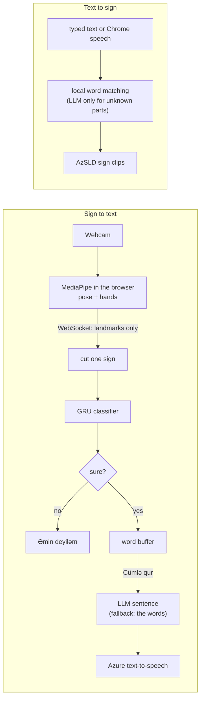

# Aven — A way to understand

**English** · [Azərbaycanca](README.az.md)

Aven is an assistive web app for **Azerbaijani Sign Language (AzSL)**. It reads signs from a webcam and writes
them as Azerbaijani text and speech, and it shows sign videos for typed or spoken Azerbaijani text. It is meant for
a deaf signer and a hearing person who meet at a service desk, in an office or on a phone, without an interpreter.

**Live demo:** https://azsl-assistant-production.up.railway.app (Chrome; allow the camera) ·
**Technical guide:** [sign-assistant/README.md](sign-assistant/README.md)

> **Safety.** Aven is an assistive prototype, not a validated translation. When it is unsure it says
> "Əmin deyiləm, zəhmət olmasa təkrar edin." and adds no word. Do not use it for medical or legal decisions:
> use a sign language interpreter.

## What it does

| | Sign → text (Direction A) | Text → sign (Direction B) |
|---|---|---|
| Who uses it | a deaf person who signs | a hearing person who types or speaks |
| Input | webcam, one sign at a time | typed text, or speech in Chrome |
| Output | each recognised word, then an Azerbaijani sentence ("Cümlə qur") read aloud ("Səsləndir") | the signs as dataset video clips, one after another, with the word as a subtitle |
| Vocabulary | 60 signs | 100 words; a word without a sign is shown in red |
| Page | `/` | `/signs.html` |

The camera image never leaves the browser: MediaPipe finds the body and hand points there and only those
coordinates go to the server.

## How it works



Python 3.11 and FastAPI on the server, PyTorch for the classifier, MediaPipe Tasks in the browser, plain HTML, CSS
and JavaScript for the pages. The interface is built to be calm: large type, a status shown with an icon, text and
colour together, a light and a dark theme, and layouts for phone, tablet, laptop and projector.

## Feasibility

Every number below was measured in this project on 9 October 2026.

| Area | Status | Measured evidence |
|---|---|---|
| Technical | Ready | Works end to end: MediaPipe in the browser at 27 ms per frame (about 37 fps on the laptop GPU), recognition on the server in 5–13 ms per sign; 245 automated tests pass. |
| Data | Ready | Open AzSLD dataset: 100 words, 7,248 videos. 60 signs are recognised; 100 words are shown as video clips. |
| Model | Partial | Validation: top-1 69.5%, macro 81.5%. When it answers it is right 95.9% of the time; it answers 40% of the clips and says "Əmin deyiləm" for the rest. |
| Cost | Low | Training takes minutes on a laptop CPU (5 min 44 s for the first 40-class model). Recognition runs in the user's browser; the LLM and speech use free tiers. |
| Legal, privacy | Ready for the demo | Data CC BY 4.0 with the signers' consent. Only landmark coordinates reach the server. |
| Use | Needs testing | No install: phone, tablet, laptop and projector. The live demo is online; testing with deaf users comes next. |

Risks and what we do about them:

- **New signers:** accuracy on a signer the model has never seen is not measured yet, because the validation set
  shares signers with training. Next: a separate test on team recordings (the protocol is in
  [data/team_recordings/README.md](sign-assistant/data/team_recordings/README.md)), then tests with deaf users.
- **Similar signs:** MƏN / MƏNİM / MƏNƏ and O / ONUN / ORDA get confused. The "not sure" rule keeps a wrong word out
  of the sentence; merging these classes is planned.
- **Small vocabulary:** 60 recognised signs (extended from 40 on 9 October 2026) and 100 shown words. More words
  and more signers are the next step.
- **Scope:** isolated signs only, no facial expressions yet. Next stage: continuous signing, face and mouth movement.

## Results

Validation on 1,280 clips from 9 recording dates, GRU model, 60 classes ([sign-assistant/eval/REPORT.md](sign-assistant/eval/REPORT.md);
the first 40-class model: [sign-assistant/eval/REPORT_40_CLASSES.md](sign-assistant/eval/REPORT_40_CLASSES.md)):

| metric | value |
|---|---|
| top-1 accuracy, no abstention | 69.5% |
| macro accuracy (classes are imbalanced) | 81.5% |
| answered clips (tau 0.9, margin 0.2) | 40.0% (512 of 1,280) |
| accuracy of the answers | 95.9% (491 of 512) |

These numbers are optimistic for a new signer: AzSLD has no signer IDs, so validation is split by recording date and
the same signers appear in training.

## Try it locally

```bash
cd sign-assistant
python3.11 -m venv .venv && source .venv/bin/activate   # Windows: py -3.11 -m venv .venv; .venv\Scripts\activate
pip install -r requirements.txt
bash scripts/get_models.sh        # MediaPipe models -> web/models/
pytest -q
uvicorn api.main:app              # http://localhost:8000 and http://localhost:8000/signs.html
```

The model weights (`model/artifacts/model.pt`) and the sign clips (`data/clips/`) are not in git: build them with
the data pipeline or copy them from a teammate. Without them every sign is answered with "Əmin deyiləm"
(`model_not_loaded`). Keys in `sign-assistant/.env` are optional (`GROQ_API_KEY` or `ANTHROPIC_API_KEY` for the
sentence, `AZURE_SPEECH_KEY` for speech); without them the app uses its fallbacks. Full setup, data pipeline,
training and deployment: [sign-assistant/README.md](sign-assistant/README.md).

## Repository

| folder | what is in it |
|---|---|
| `sign-assistant/web/` | the two pages (`index.html`, `signs.html`), their scripts, the design system (`style.css`, `ui.js`) and fonts |
| `sign-assistant/api/` | FastAPI app: recognition over WebSocket and POST, sentence composition, text-to-signs, text-to-speech |
| `sign-assistant/pose/` | landmark normalisation, features, sign segmentation, dataset landmark extraction |
| `sign-assistant/model/` | dataset, GRU and transformer networks, training, calibration, abstention, predictor |
| `sign-assistant/data/` | vocabularies, splits, clip building and data reports (raw videos, landmarks and clips stay out of git) |
| `sign-assistant/eval/` | evaluation script and report |
| `sign-assistant/tests/` | automated tests |
| `sign-assistant/docs/` | speech and LLM checks |

The team of four splits the work by role (data and model, frontend, backend and LLM, speech and evaluation);
ownership and data formats are fixed in [sign-assistant/CONTRACT.md](sign-assistant/CONTRACT.md).

## Privacy

- The webcam image stays in the browser; only body and hand coordinates are sent to the server.
- If "Səsləndir" is used, the sentence text goes to Microsoft Azure for text-to-speech.
- If the microphone is used on the text page, Chrome sends the audio to Google for speech recognition.
- If an LLM key is set, the recognised glosses and the typed text go to that LLM provider (Groq or Anthropic).

## Attribution and licences

- **Sign videos and training data:** AzSLD – Azerbaijani Sign Language Dataset, N. Alishzade and J. Hasanov,
  CC BY 4.0, DOI [10.5281/zenodo.14222948](https://doi.org/10.5281/zenodo.14222948). Clips cut and re-encoded by
  the team. Paper: Alishzade, N., Hasanov, J. (2025). AzSLD: Azerbaijani sign language dataset for fingerspelling,
  word, and sentence translation with baseline software. Data in Brief 58, 111230.
  https://doi.org/10.1016/j.dib.2024.111230
- **Landmarks:** MediaPipe Tasks pose and hand landmarkers (Google).
- **Fonts:** Archivo and Onest, SIL Open Font License 1.1 ([sign-assistant/web/fonts/OFL.txt](sign-assistant/web/fonts/OFL.txt)).
- **Services:** sentence composition and text-to-signs with an LLM (Groq or Anthropic Claude), text-to-speech with
  Azure AI Speech, speech input with the Chrome Web Speech API.
