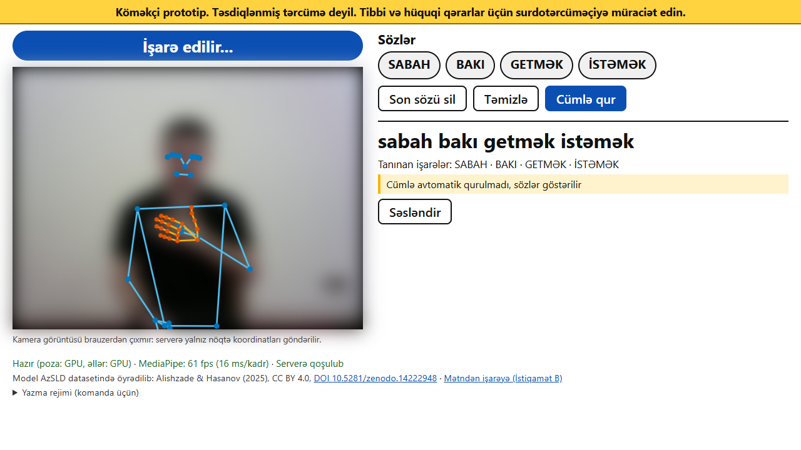
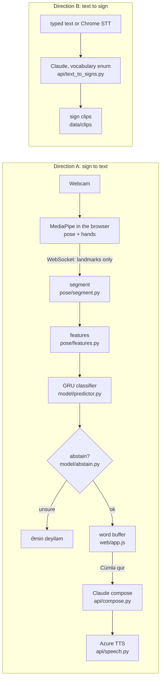

# AzSL sign assistant

Owner: C (Backend/LLM). Team rules, file ownership and data formats: [CONTRACT.md](CONTRACT.md).

## What it is

A hackathon prototype for Azerbaijani Sign Language (AzSL). Direction A recognises 60 isolated signs from a laptop
webcam and builds an Azerbaijani sentence from them; Direction B shows clips from all 100 dataset word classes for
typed or spoken text, using a separate playback vocabulary.

**Safety.** This is an assistive prototype, not a validated translation. It abstains ("Əmin deyiləm, zəhmət olmasa
təkrar edin.") when unsure, always shows the recognised glosses, and must not be used for medical or legal
decisions: use a sign language interpreter. Webcam frames stay in the browser; only landmark coordinates are sent to
the server. If speech is used, it leaves the machine: the sentence text goes to Microsoft Azure for text-to-speech,
and microphone audio goes to Google through Chrome's speech recognition. With an Anthropic key, the glosses and the
typed text are sent to Claude.



## Architecture



Known words and supported inflections in text-to-signs are matched locally without an LLM request. An LLM can
resolve unmatched spans, while known matches stay in place. Without a usable LLM, unmatched words remain visible.
Compose also has a deterministic fallback (the glosses as words). Without an Azure key, `/tts` returns 503 and
the "Səsləndir" button hides itself.

## Setup

Python 3.11 and Chrome. Run every command from `sign-assistant/`.

```bash
python3.11 -m venv .venv          # Windows: py -3.11 -m venv .venv
source .venv/bin/activate         # Windows: .venv\Scripts\activate
pip install -r requirements.txt   # about 500 MB (torch, mediapipe); CPU torch, GPU line in requirements.txt
cp .env.example .env              # Windows: copy .env.example .env
bash scripts/get_models.sh        # MediaPipe .task models -> web/models/ (Windows: run it in Git Bash)
pytest -q                         # all tests should pass
```

Windows: clone into a short path (for example `C:\azsl`). With long paths switched off (the Windows default), a
path over 260 characters breaks the installed `anthropic` package (`ModuleNotFoundError: No module named
'anthropic.types.beta...'`) and the API does not start.

No Python 3.11 installed? With [uv](https://docs.astral.sh/uv/): `uv venv --python 3.11 .venv` and
`uv pip install --python .venv -r requirements.txt` (uv downloads Python 3.11 and installs the same pins).

`.env` (never commit it): `ANTHROPIC_API_KEY` for Claude (optional), `CLAUDE_MODEL` (default `claude-opus-5-5`),
`AZURE_SPEECH_KEY` and `AZURE_SPEECH_REGION` for text-to-speech (optional), `MODEL_DIR` (default `model/artifacts`).
`data/build_clips.py` also needs `ffmpeg` on the PATH.

## Data and model

Raw videos, landmarks, clips and model weights are not in git. Either:

- **Fast path (demo):** copy from a teammate who ran the pipeline: `model/artifacts/model.pt` and
  `model/artifacts/config.json`, and `data/clips/*.mp4`. Keep the matching `data/vocab.json` in model class order;
  its IDs must exactly match `config.json`'s `classes`. Then go to [Run](#run).
- **Full pipeline:** the steps below.

## Data preparation

Details: [data/README_DATA.md](data/README_DATA.md). Runtimes measured on the team laptop (AMD Ryzen AI 7 350,
8 cores, 15 GB RAM, CPU only) on the venue network (about 1 MB/s):

| step | command | writes | runtime |
|---|---|---|---|
| 1. download | by hand from Zenodo: `AzSLD_Words_100.zip`, unzip into `data/raw/` | `data/raw/AzSLD_Words_100/` | 1.11 GB: about 20 min with 8 parallel connections |
| 2. inspect | `python -m data.inspect_dataset` | `data/index.csv`, `data/reports/dataset_summary.md` | 3 min 7 s for 7,248 videos; the first run also fetches ~5 MB of Sentences annotations (about 20 min here) |
| 3. vocabulary and split | Keep the curated `data/vocab.json` and original `data/splits.json` | Recognition class order and recording-date groups | Already supplied |
| 4. extract landmarks | `python -m pose.extract_dataset --camera any` | `data/landmarks/<video_id>.npz` for vocabulary videos | 83 videos/min per process (measured on 24 videos); it runs cores-1 processes, `--shard i/n` splits it over laptops |
| 5. clips | `python -m data.build_clips --camera any` | `data/clips/<id>.mp4`, `data/clips_index.json` | Original 40-class build: 15 s |

`--camera any` is needed because AzSLD has no camera metadata (every clip is "unknown").

The active camera model has 60 recognition classes. It keeps the original
40 classes in order and adds 20 genuine dataset classes, including `SALAM`, `NECƏ`, `YAXŞI`, `SU` and `MƏKTƏB`;
the original train/val group assignments stay intact. See [data/README_DATA.md](data/README_DATA.md) for the full list.

`python -m data.choose_vocab --min-videos 25 --min-signers 6 --camera any` produced the historical 40-class
selection. Its default cap remains 40; running it would replace the curated vocabulary and group split.
For the expanded model, retain the supplied vocabulary and splits and continue with extraction and training.

Direction B uses `data/playback_vocab.json` (100 words), independent of the recognition classes in
`data/vocab.json`. Build its additional reference clips without replacing existing clips:

```bash
python -m data.build_clips --camera any --vocab-file data/playback_vocab.json --skip-existing
```

This uses the same train groups and writes clip provenance to `data/clips_index.json`. Keep `data/clips/*.mp4`
with the app when deploying. `GET /sign-vocab` lists playback words with `clip` or `clip_missing`; `/vocab` still
lists the trained recognition classes. The text page displays the available clip count and supported words.
For example, `Salam, necəsiniz?` plays `SALAM`, `NECƏ`, `SİZ`; `Mən yaxşıyam` plays `MƏN`, `YAXŞI`.
Common cases and verb forms such as `evə`, `Bakıya`, `gedirəm` and `istəyirəm` work without an API key.

## Train, calibrate, evaluate

```bash
python -m pose.extract_dataset --camera any     # use the supplied curated vocabulary and recording-date splits
python -m model.train --arch gru --camera any   # -> model/artifacts/model.pt, config.json
python -m model.calibrate --target 0.95          # temperature, tau, margin on val only
python -m eval.evaluate --split val              # current model's val section in eval/REPORT.md
python -m eval.evaluate --split team             # after the team recordings: data/team_recordings/README.md
python -m eval.evaluate --split test --final     # once, after the feature freeze
```

Re-run `model.calibrate` after every training run: training writes placeholder thresholds.
The original 40-class validation report is preserved in [eval/REPORT_40_CLASSES.md](eval/REPORT_40_CLASSES.md).

## Run

```bash
uvicorn api.main:app
```

Open http://localhost:8000 in Chrome and allow the camera (Direction A); Direction B is http://localhost:8000/signs.html.
Without `model/artifacts`, every sign abstains with `model_not_loaded`. `GET /health` and `GET /model-info` show
the state.

## Results

The active GRU model recognises 60 classes; training used 5,080 prepared clips. Its calibrated validation report
is [eval/REPORT.md](eval/REPORT.md). The model has temperature 0.7558, tau 0.9 and margin 0.2.

**There is no unseen-signer number yet:** the test split is empty and the
team-recording section is pending (no recordings). The only numbers are on **val, which is not signer-independent**:
AzSLD has no signer IDs, val is grouped by recording date, and the same signers are in train.

### Active 60-class model

Val: 1,280 clips from the original 9 validation groups.

| metric | value |
|---|---|
| top-1 accuracy, no abstention | 69.5% |
| macro-accuracy (classes are imbalanced) | 81.5% |
| coverage at tau 0.9, margin 0.2 | 40.0% (512 of 1280) |
| selective accuracy at tau 0.9, margin 0.2 | 95.9% (491 of 512) |

For the 20 added classes, top-1 accuracy is 84.2% (96 of 114), and accepted predictions are 98.4% correct
(62 of 63). Each added class has only 2-11 validation clips, so these per-class estimates have limited evidence.
On the original 40-class subset, top-1 is 68.1%, coverage 38.5%, and selective accuracy 95.5% (429 of 449).

All 20 added classes passed selected saved-landmark `POST /recognise` checks. These are checks with existing
dataset landmarks; they do not verify a fresh webcam user or live sign segmentation.

### Historical 40-class baseline

The following figures are preserved in [eval/REPORT_40_CLASSES.md](eval/REPORT_40_CLASSES.md) and describe the
previous model.

Val: 1166 clips from 9 groups; model gru, 40 classes, temperature 0.8386, tau 0.9, margin 0.2.

| metric | value |
|---|---|
| top-1 accuracy, no abstention | 66.3% |
| macro-accuracy (classes are imbalanced) | 82.2% |
| coverage at tau 0.9, margin 0.2 | 36.8% (429 of 1166) |
| selective accuracy at tau 0.9, margin 0.2 | 96.3% (413 of 429) |

The 5 most confused pairs (symmetric rate): MƏNİM / MƏNƏ 32.2%, O / ONUN 27.3%, ONUN / ORDA 25.7%,
MƏN / MƏNİM 23.0%, O / ORDA 17.6%.

## Limitations

- **Vocabulary:** camera recognition is limited to 60 trained classes; 100 word classes are available for
  text-to-sign playback. `GET /model-info` and `/vocab` identify the active recognition model. Words outside the
  playback vocabulary still need a genuine reference clip before they can be shown.
- **Isolated signs only:** one sign at a time, hands down between signs; no continuous signing.
- **No face or non-manual features:** facial expression, mouth and head movement are ignored.
- **Data vs use:** a studio dataset of native signers (plain wall, 1280x960) against a laptop webcam and new users.
- **Signer split:** no signer IDs, so val is not signer-independent and optimistic; the team recordings
  (non-native signers) are the only signer-independent test and are not recorded yet.
- **Confusable signs:** MƏN / MƏNİM / MƏNƏ and O / ONUN / ORDA remain difficult; abstention still rejects
  60% of validation clips at the active thresholds.
- **Sentences:** Claude can still phrase a sentence wrongly; the glosses are always shown under it.
- **Direction B:** keeps Azerbaijani word order, not AzSL grammar. Local matching supports explicit aliases,
  common noun cases and a bounded set of verb forms; unsupported forms remain OOV. Greetings such as `necəsiniz`
  expand into existing word clips rather than a separately recorded phrase. Extra playback clips may lack
  landmark quality checks (`checked: false` in the clip index).
- **Speech:** STT and TTS quality are not evaluated yet ([docs/SPEECH.md](docs/SPEECH.md)); typed text is the main input.
- **Licence:** CC BY 4.0 per the Zenodo record; a team member still has to confirm it on the Zenodo page
  ([data/reports/LICENSE_CHECK.md](data/reports/LICENSE_CHECK.md)).

## Attribution

- Sign videos and training data: AzSLD – Azerbaijani Sign Language Dataset, N. Alishzade and J. Hasanov, CC BY 4.0,
  DOI [10.5281/zenodo.14222948](https://doi.org/10.5281/zenodo.14222948). Clips cut and re-encoded by the team.
  Paper: Alishzade, N., Hasanov, J. (2025). AzSLD: Azerbaijani sign language dataset for fingerspelling, word, and
  sentence translation with baseline software. Data in Brief 58, 111230. https://doi.org/10.1016/j.dib.2024.111230
- Landmarks: MediaPipe Tasks pose and hand landmarker (Google).
- Sentence composition and text-to-signs: Claude (Anthropic). Text-to-speech: Azure AI Speech. Speech input:
  Chrome Web Speech API.

## Status

- **Active model:** calibrated 60-class GRU. Direction B retains its 100-word clip map and shows OOV words.
- **Validation:** 266 tests passed. The restarted live server reported 60 classes through `/model-info` and
  `/vocab`, and 100 playback entries through `/sign-vocab`. HTTP `/recognise` accepted the correct sign for all
  20 added classes on selected validation landmark payloads. Four text-to-sign playback phrases, including
  `Salam, necəsiniz?`, also passed. These checks do not test a new webcam user or live segmentation.
- **Historical browser check (40 classes):** Direction A ran end to end in Chrome with browser MediaPipe,
  WebSocket, model, abstain, word buffer, compose and `/tts`. Dataset clips used as a fake camera produced
  SABAH, BAKI, GETMƏK and İSTƏMƏK (0.95-0.98), while MƏN abstained; abstention never added a word.
  The measured 5-13 ms feature/inference time refers to that model.
- **Not working without keys:** LLM sentence composition and resolution of unmatched text spans (fallbacks used),
  Azure TTS (503). Known playback words and supported inflections work locally without keys.
- **Measured 60-class accuracy:** val only, not signer-independent: top-1 69.5%, macro 81.5%, coverage 40.0% at 95.9%
  selective accuracy. No unseen-signer accuracy.
- **Not verified:** a real webcam with a real person, the team (unseen-signer) recordings, Claude and Azure live,
  Chrome speech recognition, the projector itself, the licence by a person.
- **Next:** record the team set and run `--split team`; merge or drop the confusable pronouns; test with deaf
  native signers; add non-manual features.
