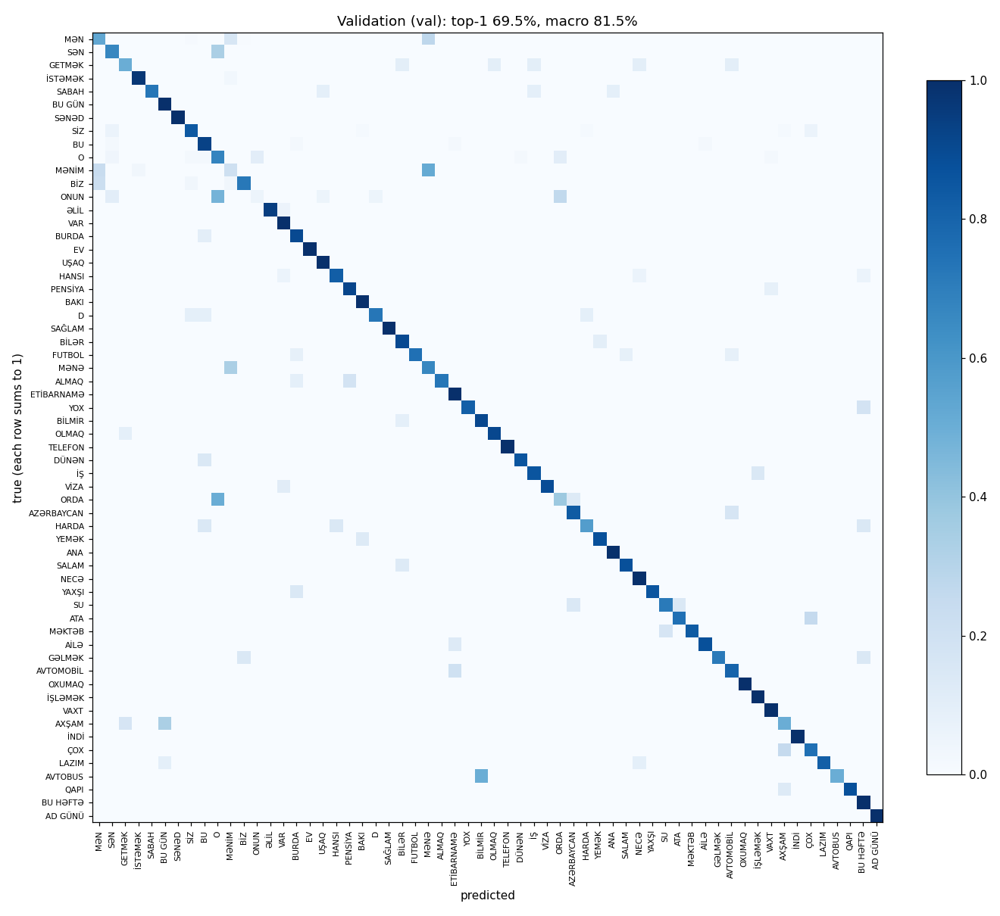

# Evaluation report

Owner: D (Direction B/Speech/Eval). Written by `python -m eval.evaluate --split val|test|team`;
each split has its own section. The test split is run once with `--final` after the feature freeze (eval/test_runs.log).

<!-- BEGIN val -->
## Validation (val)

Date 2026-10-09 11:44 UTC · commit d17e653 (+ uncommitted changes) · config sha256 c95b82b19052 · model gru, 40 classes, temperature 0.8386, tau 0.9, margin 0.2

Split: 1166 clips from 9 groups: rec_2022-05-31, rec_2022-06-16, rec_2022-07-13, rec_2022-07-21, rec_2022-07-29, rec_2022-08-02, rec_2022-11-02, rec_2022-11-19, rec_2022-12-20.
Clips without landmarks or with an unknown id (skipped): 0. segment_offline found no sign in 47 clips (diagnostic only: AzSLD clips are used whole, CONTRACT v2).

| metric | value |
|---|---|
| top-1 accuracy, no abstention | 66.3% |
| macro-accuracy (classes are imbalanced) | 82.2% |
| coverage at tau 0.9, margin 0.2 | 36.8% (429 of 1166) |
| selective accuracy at tau 0.9, margin 0.2 | 96.3% (413 of 429) |

Most confused pairs (symmetric rate = mean of the two row-normalised off-diagonal cells):

| pair | symmetric rate | counts |
|---|---|---|
| MƏNİM / MƏNƏ | 32.2% | MƏNİM→MƏNƏ 9 of 29, MƏNƏ→MƏNİM 2 of 6 |
| O / ONUN | 27.3% | O→ONUN 19 of 49, ONUN→O 3 of 19 |
| ONUN / ORDA | 25.7% | ONUN→ORDA 5 of 19, ORDA→ONUN 2 of 8 |
| MƏN / MƏNİM | 23.0% | MƏN→MƏNİM 148 of 513, MƏNİM→MƏN 5 of 29 |
| O / ORDA | 17.6% | O→ORDA 5 of 49, ORDA→O 2 of 8 |

Coverage and selective accuracy by tau (margin 0.2):

| tau | coverage | selective accuracy | answered |
|---|---|---|---|
| 0.3 | 83.4% | 70.7% | 973 |
| 0.4 | 83.2% | 70.8% | 970 |
| 0.5 | 81.1% | 71.7% | 946 |
| 0.6 | 72.5% | 73.4% | 845 |
| 0.7 | 61.0% | 77.8% | 711 |
| 0.8 | 44.9% | 89.7% | 523 |
| 0.9 | 36.8% | 96.3% | 429 |
| 0.95 | 26.8% | 98.7% | 313 |

Per-class accuracy (no abstention):

| gloss | clips | top-1 |
|---|---|---|
| MƏN | 513 | 46.2% |
| SƏN | 6 | 66.7% |
| GETMƏK | 10 | 70.0% |
| İSTƏMƏK | 34 | 97.1% |
| SABAH | 11 | 81.8% |
| BU GÜN | 8 | 75.0% |
| SƏNƏD | 11 | 100.0% |
| SİZ | 83 | 90.4% |
| BU | 54 | 96.3% |
| O | 49 | 38.8% |
| MƏNİM | 29 | 48.3% |
| BİZ | 32 | 71.9% |
| ONUN | 19 | 47.4% |
| ƏLİL | 18 | 94.4% |
| VAR | 24 | 100.0% |
| BURDA | 20 | 75.0% |
| EV | 15 | 100.0% |
| UŞAQ | 20 | 100.0% |
| HANSI | 17 | 94.1% |
| PENSİYA | 12 | 91.7% |
| BAKI | 11 | 81.8% |
| D | 11 | 90.9% |
| SAĞLAM | 10 | 100.0% |
| BİLƏR | 10 | 90.0% |
| FUTBOL | 12 | 83.3% |
| MƏNƏ | 6 | 66.7% |
| ALMAQ | 11 | 72.7% |
| ETİBARNAMƏ | 8 | 100.0% |
| YOX | 11 | 90.9% |
| BİLMİR | 11 | 100.0% |
| OLMAQ | 11 | 90.9% |
| TELEFON | 11 | 100.0% |
| DÜNƏN | 7 | 85.7% |
| İŞ | 7 | 100.0% |
| VİZA | 9 | 88.9% |
| ORDA | 8 | 37.5% |
| AZƏRBAYCAN | 6 | 83.3% |
| HARDA | 7 | 71.4% |
| YEMƏK | 8 | 87.5% |
| ANA | 6 | 83.3% |

**What this means.** Without abstaining, the model names the right sign for 66% of these clips; counting every sign equally (macro) it is 82%. The worst mix-up is MƏNİM / MƏNƏ. Top-1 is lower than macro because most errors come from one big class: MƏN is wrong in 276 of 513 clips, mostly taken for MƏNİM. With the abstain rule (tau 0.9, margin 0.2) it answers 37% of the clips and says "Əmin deyiləm" for the rest; when it answers it is right 96% of the time. Caution: val groups are recording dates of the same AzSLD signers that are in train, so these numbers are optimistic for a new signer; only the test and team sections measure that.
<!-- END val -->

<!-- BEGIN team -->
## Team recordings (non-native signers, webcam)

**Status: not run yet.** No team recordings exist (0 clips), so there are no team numbers. Protocol:
data/team_recordings/README.md. When 3-4 team members have recorded every vocabulary word 3-5 times, run
`python -m eval.evaluate --split team`; it replaces this section with the results.

**Signer independence.** AzSLD has no signer IDs. The dataset split groups clips by recording date, so the same
AzSLD signers are in train and val: the val numbers above are **not signer-independent**. The team recordings are
the only signer-independent test. The recorders are **not native signers** of AzSL: each learns a sign from the
dataset clip just before recording it, so their results do not stand for deaf AzSL users.
<!-- END team -->
